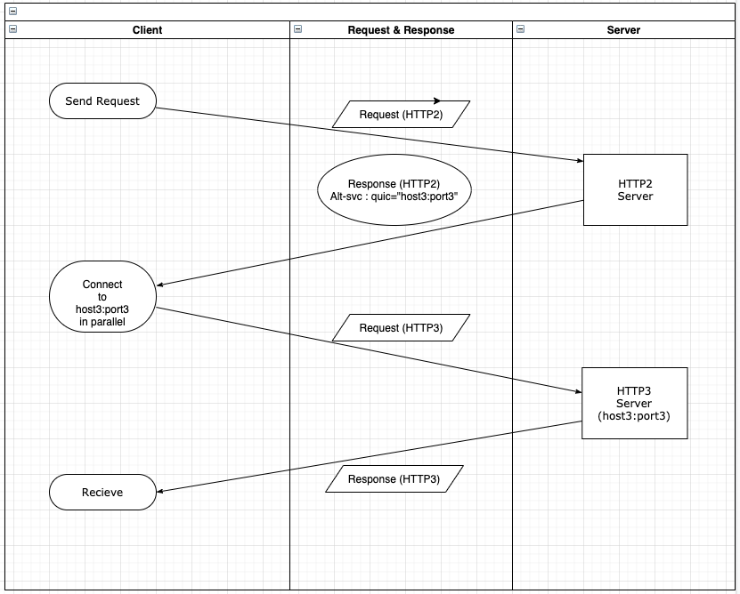

---
title: "Requirements in applying HTTP 3.0"
date: 2020-11-02 17:00:00 -0400
categories: study update
___

# outline
1. Alt-svc 해더와 
2. 단계별 HTTP 3.0 적용
3. 현재 HTTP 3.0을 지원하는 browser & Server

## 1. Alt-svc 해더와 단계별 HTTP 3.0 적용
**Alt-svc**: 사용 가능한 대안의 서비스를 알려준다.

* eg)  Alt-Svc: h2="new.example.org:80"

`http2.0`을 사용해서 `new.example.org`의 `80`번 포트를 사용.

## 2. 단계별 HTTP 3.0 적용

#### 기존 example.com:20000에서 http/2.0 수행 한다고 가정하면
#### example.com:20001 에서 http/3.0을 수행.
클라이언트에서 http/3.0을 수행하는 곳으로 요청을 보내도록 유도.
3.0에 보냈지만, 존재하지 않는 경우 alt-svc 응답을 통해 2.0으로 요청 변경하도록 유도.

## 3. 현재 HTTP 3.0을 지원하는 browser & Server

| name | version | role | Implementation |
| ---- | ---- | ---- | --- |
| nginx | 1.19 | server| [link](https://www.nginx.com/blog/introducing-technology-preview-nginx-support-for-quic-http-3/)|
| envoy | X | server| |
| haproxy | 2.3 | server| [link](https://www.haproxy.com/blog/announcing-haproxy-2-3/)|
| apache | X | server| | 
| chrome | | browser | [link](https://blog.chromium.org/2020/10/chrome-is-deploying-http3-and-ietf-quic.html)|
| safari | maxOS11 & iOS14| browser | [link](https://www.iphoneincanada.ca/news/apple-safari-http3-ios-14/) |
| whale | X | | |
