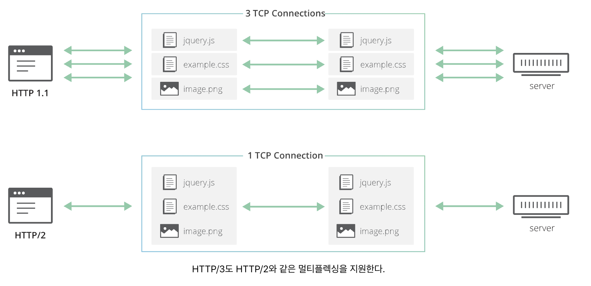

---
title: "Details of HTTP/3"
date: 2020-11-02 17:00:00 -0400
categories: study update
___

# outline
1. UDP 정의
2. UDP의 작동원리 및 특징
3. O-RTT
4. Multiplexing
5. HPACK vs QPACK
6. HTTP 버젼별 비교

## 1. UDP 정의 
**UDP(User Datagram Protocol)**: 데이터그램(독립적인 관계를 지니는 패킷)을 사용하는 프로토콜이다. TCP와 비교하여 빠르나 신뢰성이 떨어진다.

## 2. UDP 작동 원리 및 특징
* 비 연결형 프로토콜이다. 연결을 설정하고 해제하는 과정이 존재하지 않는다.
* 데이터 그램 (독립적인 관계를 지니는 패킷)을 사용한다. 서로 다른 경로로 독립적으로 패킷을 전송하여 빠르고 부하가 적다. 
* 신뢰성있는 데이터 전송을 보장해주지 못하기 때문에, 신뢰성보다는 연속성이 중요한 서비스에 많이 사용된다. (Streaming)
* 손실 감지: 패킷 번호 공간 부여. 전송 순서 자체만을 나타낸다. 매 전송마다 모노토닉하게 번호가 증가.

## 3. O-RTT

**RTT(Round Trip Time)**: 클라이언트가 보낸 요청을 서버가 처리한 후 다시 클라이언트로 응답해주는 사이클.

* TCP : 1 RTT (TCP 연결)
* TCP + TLS: 3 RTT가 필요. (TCP 연결. TLS 암호화 연결. TLS 완료.)
* UDP: 1 RTT (첫 연결 설정.) 0 RTT ( 한번 연결에 성공하면, 그 설정을 캐싱 해 놓고 다음 연결시 바로 연결 성립)

## 4. Multiplexing
**Multiplexing**: 하나의 connection 상에서 동시에 여러개의 request를 보내는 기술. 각각의 데이터 흐름을 스트림이라 부른다.

* HTTP/1.1의 경우 하나의 TCP 연결에 하나의 스트림만 사용하기 때문에 HOLB 문제를 가지고 있음. Kepp-alive 옵션으로 어느 정도의 연결을 유지할 수는 있지만 한계가 있음.
* HTTP/2, 3 의 경우 하나의 연결에서 여러개의 데이터를 전송할 수 있기 때문에 핸드 쉐이크 감소 + 효율적 데이터 전송.

## 5. HPACK vs QPACK
**HPACK**: 무손실 압축을 하는 알고리즘(Huffman code를 사용)을 사용해서 Header정보를 압축한다. 요청과 응답의 중복되는 부분을 제거해 전송되는 데이터의 양을 줄일 수 있다.
**QPACK**: 순서가 바뀐 전송에서도 헤더의 도착 순서를 보장.

HPACK의 순차적인 스트림 전달 순서 없이 전달 가능하게 하여 병렬처리 성능을 개선하여 나온 QPACK

## 6. HTTP 버젼별 비교

| 항목 \ Version | HTTP 1.1 | HTTP 2 | HTTP 3 | 
| ------ | -----| ----- | ----- | 
| Multiplexing| X | O | O |
| Header 압축 | X| O | O |
| Server Push | X | O | O|
| Binary Protocols | X | O | O |
| TCP/UDP | TCP | TCP | UDP |

* Packet 비교.

[현재 진행 상황](https://www.fastly.com/blog/state-of-quic-and-http3-2020)
