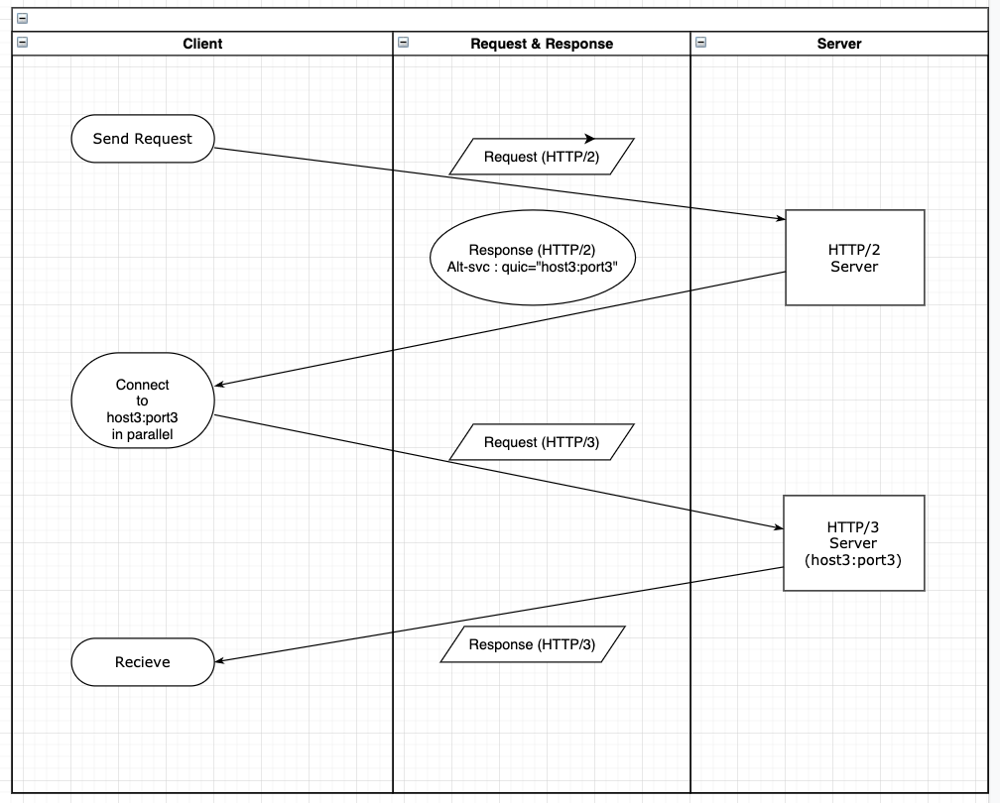

---
title: "Requirements in applying HTTP/3"
date: 2020-11-02 17:00:00 -0400
categories: study update
___

# outline
1. Alt-svc 해더와 
2. 단계별 HTTP/3 적용
3. 현재 HTTP/3을 지원하는 browser & Server

## 1. Alt-svc 해더와 단계별 HTTP/3 적용
**Alt-svc**: 사용 가능한 대안의 서비스를 알려준다.

* eg)  Alt-Svc: h2="new.example.org:80"

* 지속시간 :24시간. (ma=? 로 시간 설정 가능)

`http2.0`을 사용해서 `new.example.org`의 `80`번 포트를 사용.

## 2. 단계별 HTTP/3 적용

#### example.com:20000에서 http/2 또는 http/1.1 수행 한다고 가정.
#### example.com:30000 에서 http/3을 수행.

1. Client가 example.com:20000으로 Request
2. examle.com:20000에서 Alt-svc와 함께 Response (Alt-svc: quic="example.com:30000" 또는, Alt-svc: quic:":30000")
3. Client가 Alt-svc를 확인하고, HTTP/3을 지원한다면 호출처 변경
4. Client가 example.com:30000으로 Request (HTTP3.0)
5. example.com:30000으로 부터 QUIC Response

## 3. 현재 HTTP/3을 지원하는 browser & Server

| name | version | role | Implementation |
| ---- | ---- | ---- | --- |
| nginx | 1.19 | server| [link](https://www.nginx.com/blog/introducing-technology-preview-nginx-support-for-quic-http-3/)|
| envoy | X | server| |
| haproxy | 2.3 | server| [link](https://www.haproxy.com/blog/announcing-haproxy-2-3/)|
| apache | X | server| | 
| chrome | 지원하지 않지만, 실행 가능 | browser | [link](https://blog.chromium.org/2020/10/chrome-is-deploying-http3-and-ietf-quic.html)|
| safari | maxOS11 & iOS14 지원하지 않지만, 실행 가능| browser | [link](https://www.iphoneincanada.ca/news/apple-safari-http3-ios-14/) |
| whale | X | browser | |
| IE | X | browser | |
