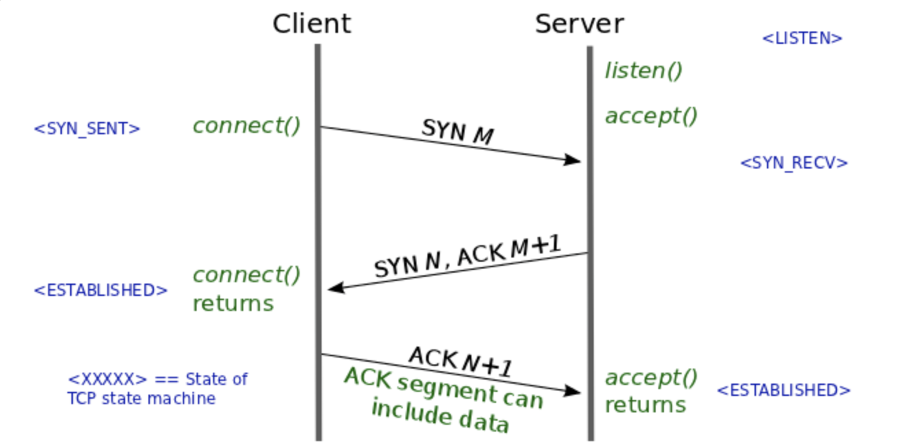

---
title: "TCP vs UDP"
date: 2020-11-02 17:00:00 -0400
categories: study update
___

# outline
1. TCP 정의
2. TCP의 작동원리
3. 성능 저하 요인 (3 way handshaking, TCP HOL(Head of Line) blocking

## 1. TCP의 정의
**TCP(Transmission Control Protocol)**: 서버와 클라이언트간에 데이터를 신뢰성 있게 전달하기 위해 만들어진 프로토콜이다. 신뢰성이 높고 연결 지향적이다.

## 2. TCP 작동 원리
* IP를 통해 패킷을 목적지 까지 보낸다.
* 데이터 누락, 패킷 순서 뒤바뀜등의 테이터 검사 및 교정이 가능하다.
* 3단계로 커넥션을 맺는다. (3 way handshaking)

## 3 way handshake
**3 Way handshake**: TCP 소켓으로 클라이언트와 서버가 연결되는 과정. SYNC와 ACK라는 패킷을 주고 받아 패킷 순서, 패킷 수신 여부 확인.

1. 클라이언트가 서버에 접속요청(sync)을 하고 클라이언트는 sync_sent 상태가 됨. 시퀀스 번호 (seq)를 보냄
2. 서버는 요청수락(sync+ack)하고 서버는 sync_received 상태가 됨. 시퀀스 번호를 1 증가 시켜 ack 필드에 담아 보냄.
3. 클라이언트는 서버에 수락확인(ack)을 보내고 서버는 established 상태가 됨. 서버로 부터 받은 시퀀스 번호를 1 증가시켜서 자신의 ack 필드에 담아 보냄.

#### TCP를 사용하면 통신을 시작하기 전 무조건 3 way handshaking이라는 과정을 거쳐야 한다.

* HTTP 1.1은 하나의 tcp 연결에서 하나의 요청만 처리하고 연결을 끊는다.
* HTTP 2.0은 단일 TCP 연결을 유지하면서 여러개의 요청을 처리.
* HTTP 3.0은 handshake를 없애고 다른 방식으로 연결의 신뢰성 확보.

## 3. TCP HOL(Head Of Line) Blocking
**HOL Blocking**: 패킷이 중간에 유실되거나 수신 측의 패킷 파싱 속도가 느릴때 통신이 병목이 발생하게 되는 현상. TCP 자체의 문제이며 패킷의 처리 속도가 지연되고, 최악의 경우 드랍 발생.

* TCP 통신에서 패킷은 반드시 순서대로 처리되어야 한다.(시퀀스 번호를 참고하여 패킷을 재조립하기 때문에)
* HTTP2 에서는 Stream을 통한 multiplexing으로 slow first resource에 대한 문제를 해결.
* 단, TCP packet 유실이 있다면, 모든 later packet들은 재전송을 가다려야 하며 HOL blocking이 발생한다.
