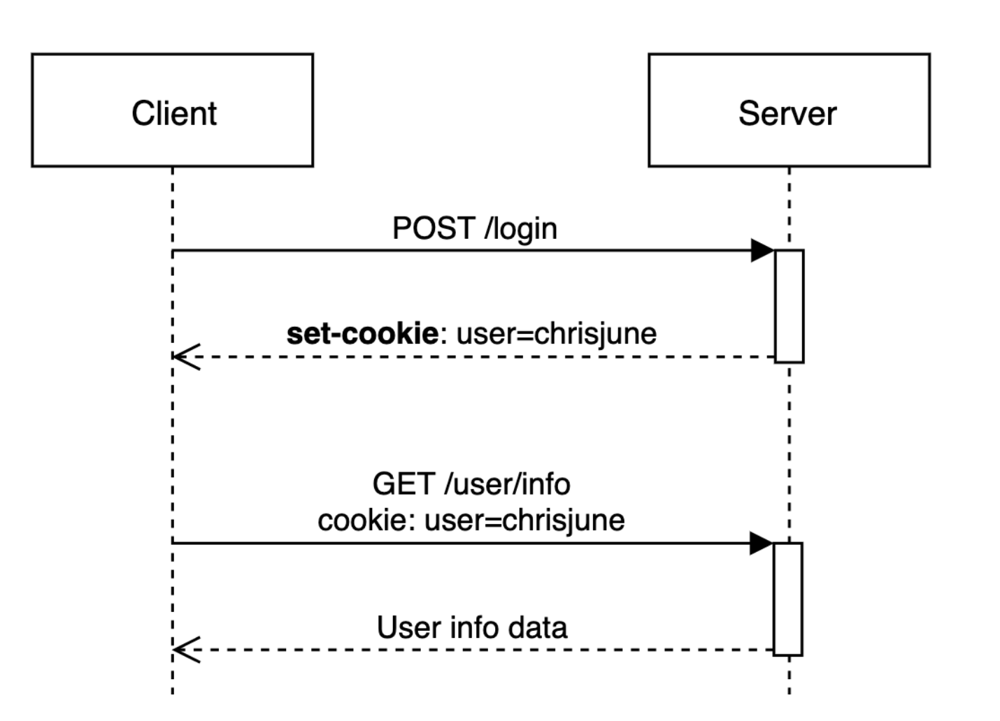
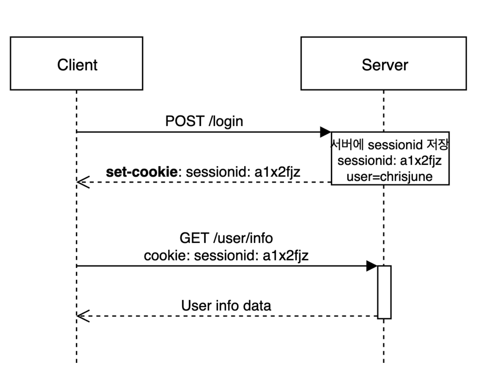

# cookie and session 🍪

## HTTP 의 특징
* Connectionless : 서버가 client의 요청에 응답하고 커넥션을 끊는 성질 (keep-alive로 유지 가능)
* Stateless : 커넥션을 끊음으로 클라이언트의 상태 정보를 알 수 없는 성질.

HTTP의 약점을 보완하기 위해서 Cookie와 session 사용. 또한, 클라이언트가 누구인지 파악하기 위해 사용

## Cookie 🍪
**Cookie: key-value pair file stored on client's local.**
##### Component : coockie name, cookie value, expiration time, domain, path

다음과 같이 쿠키 값을 설정한다.
rsp header => set-cookie : user=eddy
req header => cookie : eddy

### 쿠키의 특징
* 사용자 인증이 유효한 시간을 명시할 수 있다. (브라우져가 종료되어도 인증이 유지되는 특징...)
* 클라이언트의 상태 정보를 로컬에 저장했다가 참조. (300개까지 쿠키 저장 가능.)
* 서버에서 쿠키 상태 업데이트가 필요할때, 쿠키를 업데이트 하여 변경된 쿠키를 HTTP 해더에 포함시켜 응답함.

## Session
**Session: maintain client's request until the browser ends.**
쿠키를 기반으로 하고 있지만, 서버측에서 세션을 관리

작동원리
클라이언트의 로그인 요청의 유효성을 확인하고 unique한 id를 sessionid라는 이름으로 저장한다.
rsp header => set-cookie : sessionid:a1b2c3
req header => cookie : sessionid:a1b2c3

### 세션의 특징
* 쿠키를 기반으로 하지만 서버에 파일을 저장 및 관리한다. (세션이 많아지면 서버 터질 수 있음. ㅜ.ㅜ)
* 서버에서 클라이언트를 구분하기 위해, 세션ID를 부여하고 브라우져가 종료될 때 까지 인증 상태 유지. (접속 시간 제한이 있어, 응답이 없으면 정보가 유지 되지 않음)
* 서버에 정보를 두어 보안에 좋지만, 사용자가 많을 수록 서버 메모리를 많이 차지하게 된다. (동접자 수가 많으면 성는 저하의 요인)

## Cookie VS Session

| \ | Cookie | Session |
| -- | --- | --- |
| 저장 위치 | local | server |
| security | 탈취 변조 가능 | 상대적으로 안전 |
| Lifecycle | 브라우저 종료해도 파일로 남아 있음 | 브라우져 종료 시 세션 삭제 |
| Speed | 파일에서 읽어 상대적으로 빠름 | 요청마다 서버에서 처리하게때문에 상대적으로 느림 |

[reference](https://interconnection.tistory.com/74)
[reference](https://chrisjune-13837.medium.com/web-%EC%BF%A0%ED%82%A4-%EC%84%B8%EC%85%98%EC%9D%B4%EB%9E%80-aa6bcb327582)
