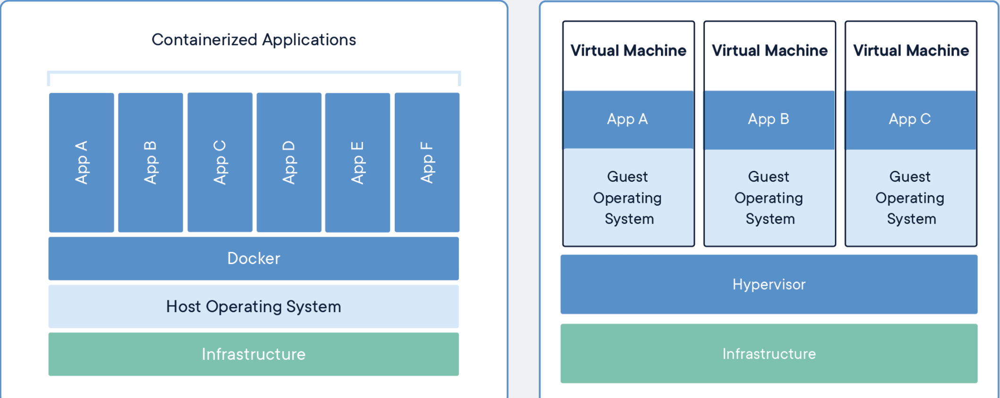
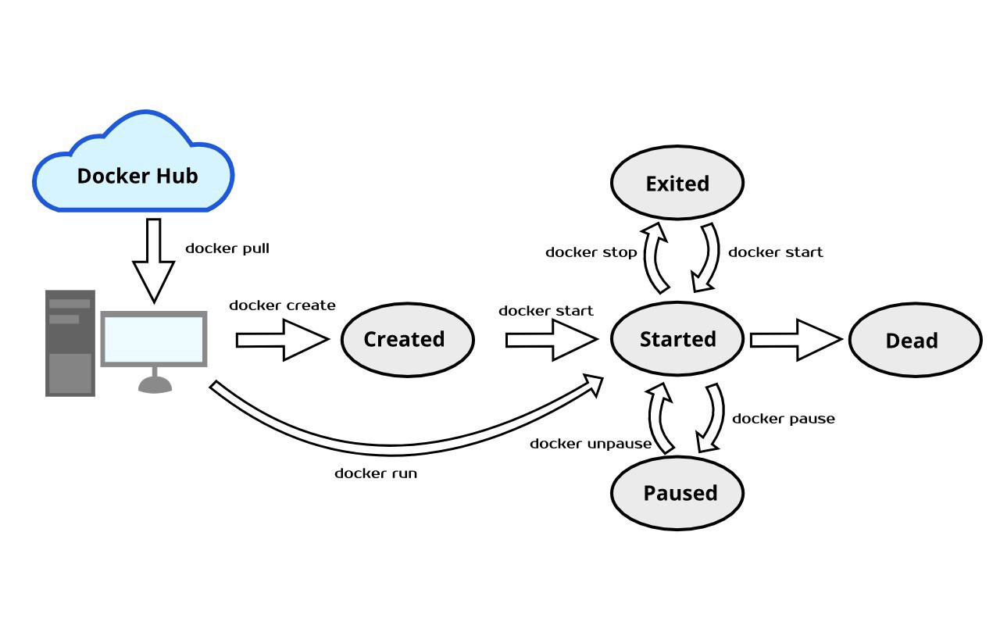

# Container

**Container: 코드와 모든 dependencies를 포함하는 소프트웨어 패키지이다. application이 빠르게 동작하고, `독립된` 환경을 구축할 수 있다. docker는 컨테이너의 한 종류이다. 컨테이너 단위로 os, libarary, application을 하나로 패키징 할 수 있다.**

**Container Image: Runtime에서 (도커 엔진에서 run 할때) 이미지가 컨테이너로 전환된다.**

## Container 사용시 장점
* 서비스의 배포 단위로 컨테이너 이미지를 만들어서 사용할 수 있다. (1. Immutable하게 배포/롤백을 쉽게 할 수 있다. 2. Continuous Development, Continuous Integration에 적합하다.)
* 컨테이너 관리와 어플리케이션의 관리를 분리할 수 있다. (컨테이너 클러스터 관리와 어플리케이션 배포가 분리된다.)
* MSA에 적합하다.
* resource를 효율적으로 사용할 수 있다.

## 컨테이너와 VM의 차이

| / | Container | VM |
| -- | -- | -- |
| Definition | | |
| 분리 방식 | os를 가상화. 커널을 host와 공요. | 가상화된 하드위에 os가 올라가는 형태. host와 완벽하게 분리|
| 사이즈 | docker engine 위에서 필수적인 바이너리만 올라감. `작다` | hypervisor, hardware 가상화. `크다` |
| 크기 | host보다는 느리지만 vm보다 빠름 | 느리다. (io가 발생하는 통로가 많다. 커널 처리가 많아서 속도 지연 발생.) |
| LifeCycle | image를 registry에 배포. 개서 올리고 기존꺼 내리고. 컨테이너 오케스트레이션 적용. | 버전업시: repo pull. 다수 서버에 일일이... 스크립트 에러 가능성... |
| 보안 | 컨테이너 하나가 노출되면 전체 os에 문제 | 하나의 vm이 공격당해도 안전|

## Docker Life Cycle

## Docker Architecture

* Docker daemon (dockerd): listen for DOCKER API requests. Manage Docker objects such as images, containers, networks and volumes. Communicate wtih other docker daemons to manage Docker services.

* Docker Client (docker) : 사용자가 docker와 interact하는 방법. cmd (docker ls) ->(send req) dockerd

* Docker Registries : Docker image를 저장. `docker run`, `docker pull` 커맨드 사용할때 설정한 registry에서 pull.

### Docker Objects 
* Images : read-only template with instruction for creating Docker container. 다른 이미지를 베이스로 두고 만들 수 있다. 
* Containers: runnable instance of an image. Docker API/CLI를 통해서 create, start, stop, move or delete 가능하다.
