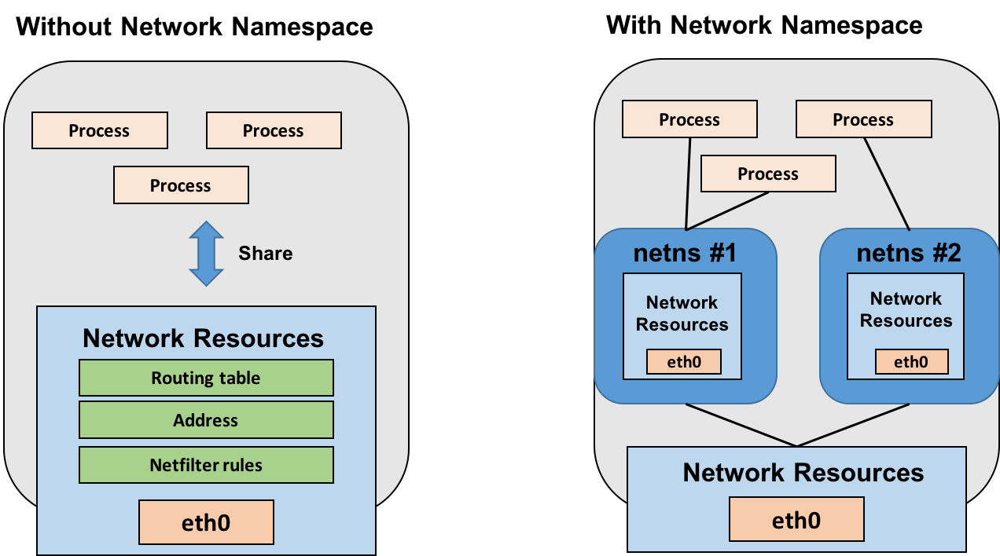

# Namespace

**namespace: 커널의 resources을 분리하기 위해 사용되는 linux kernel 기술이다.**
* 하나의 프로세스가 하나의 리소스를 가리키고, 다른 프로세스는 다른 리소스를 가리키도록 한다. 즉, 프로세스 생성 시점에 어떤 네임스페이스를 사용할 지 선택하며, 네임스페이스 별로 독립된다.
* 컨테이너라 부르는 workspace를 독립시키기 위해서 docker에서 사용된다.

### namespace 가 docekr 에서 어떻게 사용될까?
컨테이너를 run할때, docker가 컨테이너를 위한 namespaces들을 생성한다. 이 namespace 들은 독립을 위한 레이어를 제공한다.

#### Docker Engine이 linux에서 namespace를 사용하는 곳:
* pid: Process isolation
* net: Manage network interfaces
* ipc: Manage access to IPC resources (InterProcess Communication)
* mnt: Manage filesystem mount points
* uts: Isolate kernel and version identifiers (Unix Timesharing System)
