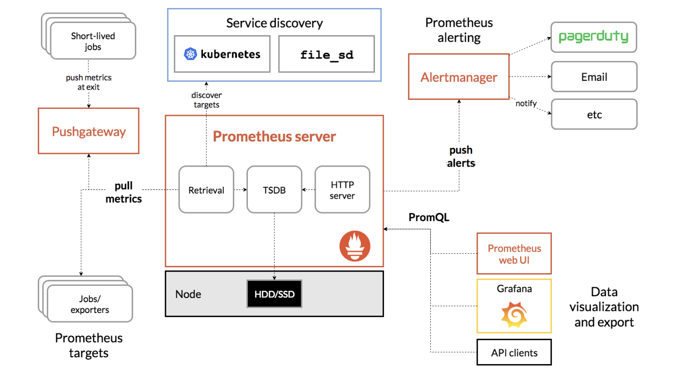

# Prometheus

`prometheus`: system monitoring and alerting tookit.

## Features 
* multi dimensional data model with time series data
* PromQL
* no reliance on distributed storage
* time series collection heppens vai a pull model over HTTP
* pusshing time serires is supported via an intermediary gateway
* targets are discovered via service discovery or static configuration
* multiple modes of graping and dashboarding support

## Component
* the main Prometheus server which scrapes and stores time series data
* client libraries for instrumenting application code
* a push gateway for supporting short-lived jobs
* special-purpose expoerters for services lik HAProxy, StatsD, Graphite, etc.
* an alertmanager to handle alerts

## Architecture

## Fit and Not Fit
`fit`: recording any purely numeric time series. 

`not fit`: 100% accuracy condition (prometheus are available even under failure conditions)
