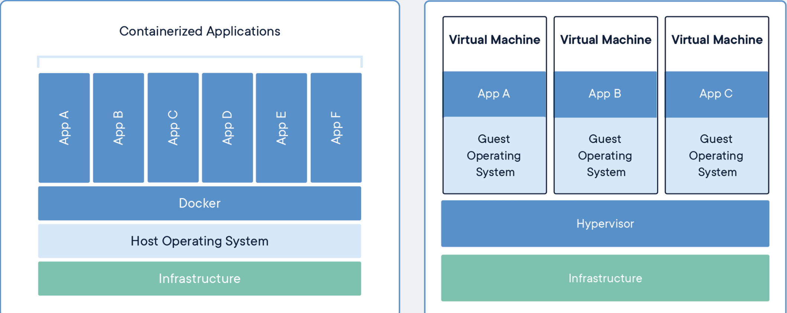

# Docker

**Container: 코드와 모든 dependencies를 포함하는 소프트웨어 패키지이다. application이 빠르게 동작하고, 독립된 환경을 구축할 수 있다. docker는 컨테이너의 한 종류이다.**

**Container Image: Runtime에서 (도커 엔진에서 run 할때) 이미지가 컨테이너로 전환된다.**

### 컨테이너와 VM의 차이

* 

